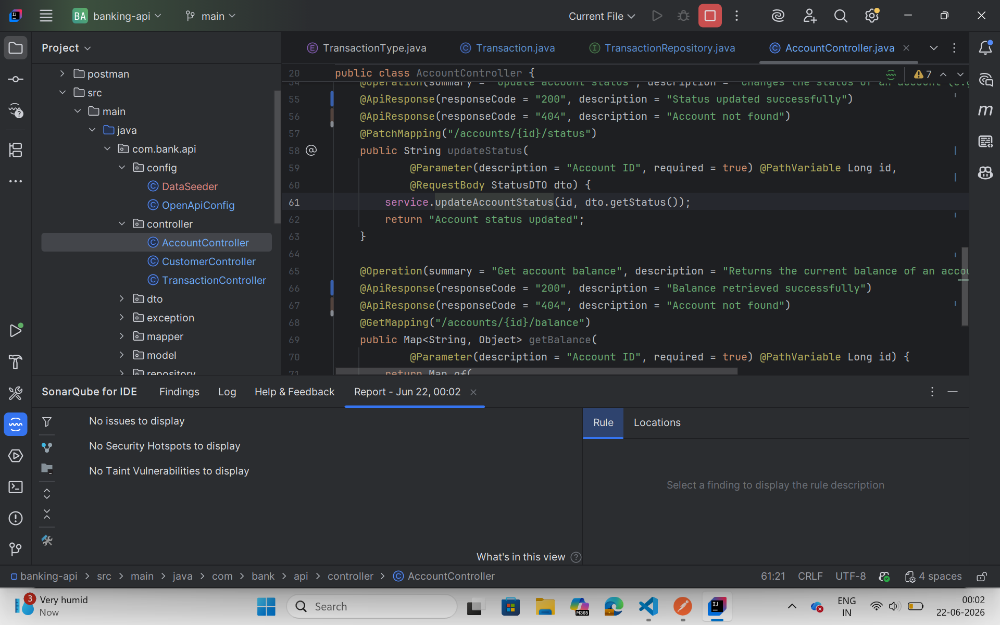

# Banking API

A Mini Banking & Account Management REST API built with Spring Boot 3 and Java 17.  
Simulates a simplified retail banking back-end with customer management, account operations, and financial transactions.

---

## Prerequisites

| Tool | Version |
|------|---------|
| Java | 17+ |
| Maven | 3.9+ |
| Git | Any |

No external database setup required — uses H2 in-memory database.

---

## How to Run

```bash
# Clone the repository
git clone <your-repo-url>
cd banking-api

# Run the application
mvn spring-boot:run
```

The application starts on **http://localhost:8080**

Demo data (3 customers, 4 accounts, 7 transactions) is seeded automatically on startup.

---

## Access Points

| URL | Description |
|-----|-------------|
| http://localhost:8080/swagger-ui.html | Swagger UI — interactive API docs |
| http://localhost:8080/v3/api-docs | OpenAPI JSON spec |
| http://localhost:8080/h2-console | H2 database console (JDBC URL: `jdbc:h2:mem:bankingdb`) |

---

## API Endpoints

### Customer Management

| # | Method | Endpoint | Description |
|---|--------|----------|-------------|
| C-01 | POST | `/api/v1/customers` | Create a new customer |
| C-02 | GET | `/api/v1/customers/{id}` | Get customer by ID |
| C-03 | GET | `/api/v1/customers?page=0&size=5` | List all customers (paginated) |
| C-04 | PUT | `/api/v1/customers/{id}` | Update customer (email, mobile) |
| C-05 | DELETE | `/api/v1/customers/{id}` | Soft-delete customer (sets INACTIVE) |

### Account Management

| # | Method | Endpoint | Description |
|---|--------|----------|-------------|
| A-01 | POST | `/api/v1/accounts` | Open a new account for a customer |
| A-02 | GET | `/api/v1/accounts/{id}` | Get account details with balance |
| A-03 | GET | `/api/v1/customers/{id}/accounts` | List all accounts for a customer |
| A-04 | PATCH | `/api/v1/accounts/{id}/status` | Activate / Suspend / Close account |
| A-05 | GET | `/api/v1/accounts/{id}/balance` | Balance enquiry |

### Transactions

| # | Method | Endpoint | Description |
|---|--------|----------|-------------|
| T-01 | POST | `/api/v1/transactions/deposit?accountId=1&amount=500` | Deposit funds |
| T-02 | POST | `/api/v1/transactions/withdraw?accountId=1&amount=200` | Withdraw funds |
| T-03 | POST | `/api/v1/transactions/transfer?fromId=1&toId=2&amount=100` | Transfer between accounts |
| T-04 | GET | `/api/v1/accounts/{id}/transactions?page=0&size=10` | Transaction history (date-range filter supported) |
| T-05 | GET | `/api/v1/accounts/{id}/mini-statement` | Last 5 transactions |

---

## Business Rules

| Rule | Violation Response |
|------|--------------------|
| Withdrawal cannot exceed balance | `422 Unprocessable Entity` — `InsufficientBalanceException` |
| Deposit/Withdraw amount must be > 0 | `400 Bad Request` — `ValidationException` |
| Transfer source ≠ destination account | `400 Bad Request` — `ValidationException` |
| Cannot transact on SUSPENDED or CLOSED account | `409 Conflict` — `AccountStatusException` |
| Customer email must be unique | `409 Conflict` — `DuplicateResourceException` |
| Cannot close account with balance > 0 | `409 Conflict` — `AccountClosureException` |

All error responses follow **RFC 7807 ProblemDetail** format:
```json
{
  "type": "https://banking-api.com/errors/insufficient-balance",
  "title": "Insufficient Balance",
  "status": 422,
  "detail": "Insufficient balance. Available: 100.00, Requested: 500.00"
}
```

---

## Running Tests

```bash
mvn test
```

**33 tests** across 3 service classes — target 70%+ line & branch coverage.

| Test Class | Tests |
|-----------|-------|
| `CustomerServiceTest` | 9 |
| `AccountServiceTest` | 9 |
| `TransactionServiceTest` | 14 |
| `BankingApiApplicationTests` | 1 (context load) |

---

## Project Structure

```
com.bank.api
  ├── controller/       → REST controllers
  ├── service/          → Business logic interfaces + impl
  ├── repository/       → Spring Data JPA repositories
  ├── model/            → JPA entities (Customer, Account, Transaction)
  ├── dto/              → Request/Response DTOs
  ├── exception/        → Custom exceptions + GlobalExceptionHandler
  ├── mapper/           → Entity ↔ DTO conversion
  ├── config/           → OpenApiConfig, DataSeeder
  └── BankingApiApplication.java
```

---

## Postman Collection

Import from `/postman/banking-api-collection.json` and use `/postman/banking-api-environment.json` as the environment (`baseUrl = http://localhost:8080`).

---

## SonarLint Screenshot



---

## Known Assumptions

- Account balance on creation is accepted from the request body; defaults to `0.00` if not provided.
- Soft-delete on Customer sets status to `INACTIVE` — the record is retained in the database.
- Account status transitions are not strictly ordered (e.g. ACTIVE → SUSPENDED → ACTIVE is allowed).
- Transaction records are immutable once created — there is no delete/update transaction endpoint.
- All monetary amounts are stored and returned as `BigDecimal` to avoid floating-point precision issues.
- The `TRANSFER` transaction type is recorded in `TransactionType` enum but individual transfer legs are recorded as `DEBIT` (source) and `CREDIT` (destination) for clear balance tracking.
